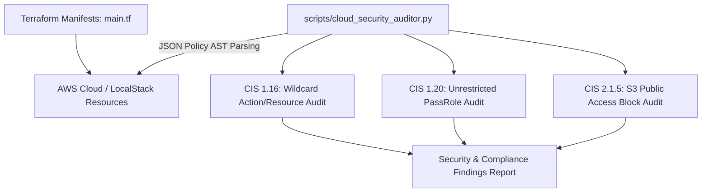

# Cloud Security AWS IAM & CIS Hardening Lab

[](LICENSE)
[](https://github.com/toprakahmetaydogmus/03-cloudsec-aws-audit/actions)
[](#)
[](#)

Geliştirici: **Toprak Ahmet Aydoğmuş**

---

## 🎯 Proje Amacı ve Kapsamı
AWS bulut altyapılarında **IAM Least Privilege** prensiplerinin uygulanması, S3 kova (bucket) güvenlik politikaları ve CIS AWS Foundations Benchmark kontrollerini otomatize eden güvenlik denetim aracı ve IaC şablonları.

---

## 🏗️ Mimari Şema



---

## 🚀 Güvenlik Kontrolleri
- **CIS 1.16:** IAM politikalarında `*:*` (Wildcard) yönetici yetkisi denetimi.
- **CIS 1.20:** `iam:PassRole` eyleminin tüm kaynaklara (`*`) verilerek yetki yükseltme vektörü oluşturmasının engellenmesi.
- **CIS 2.1.5:** S3 kova genel erişim engelleme (Public Access Block) ve varsayılan KMS şifreleme kontrolü.

---

## ⚡ Hızlı Başlangıç

```bash
git clone https://github.com/toprakahmetaydogmus/03-cloudsec-aws-audit.git
cd 03-cloudsec-aws-audit

# Unit testleri çalıştırın
python -m unittest discover tests/

# Bulut güvenlik denetim aracını çalıştırın
python scripts/cloud_security_auditor.py
```

---

## 📜 Lisans
MIT License - **Toprak Ahmet Aydoğmuş**
