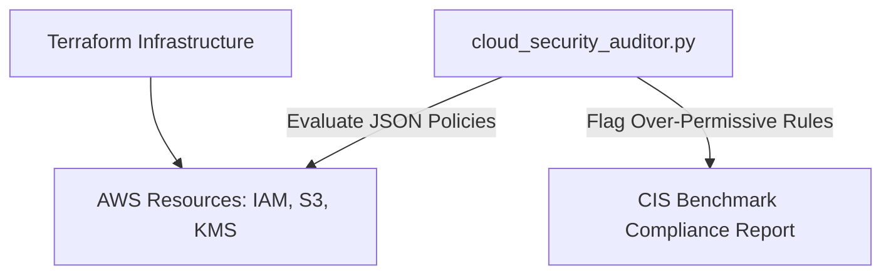

# Cloud Security AWS IAM & CIS Hardening Lab
[](LICENSE)
[](#)
[](#)

Geliştirici: **Toprak Ahmet Aydoğmuş**

Bu proje; AWS bulut ortamlarında **IAM Least Privilege**, S3 Public Access engelleme ve CloudTrail denetimlerini otomatikleştiren bir Cloud Security posture yönetim aracıdır.

## Mimari


## Hızlı Başlangıç
```bash
# Python güvenlik denetim motorunu çalıştırın
python3 scripts/cloud_security_auditor.py
```

## Lisans
MIT License - Toprak Ahmet Aydoğmuş
